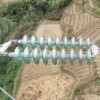

# Weakly-Supervised Learning based Automatic Augmentation of Aerial Insulator Images
##Small Insulator Dataset
This is a small dataset for validation, the dataset is built in Voc format  
- root
    - JPEGImages
        - 000001.jpg
        - 000002.jpg
    - Annotations 
        - 000001.xml
        - 000002.xml
    - Instances
        - 000001.png
        - 000002.png
    - ImageSets
        - Main
            - train.txt
            - val.txt
    
          
>train: 34 insulators with bounding box label  
>val: 30 insualtors with instance segmentation label  

The dataset is shared at [InsulatorObj (code:gya9)](https://pan.baidu.com/s/1hdkeafgj6mpnJcnPizxxeg)
##Pretrained Weight
The pretrained weight of insulator dataset is shared at [insu weight (code: exjk)](https://pan.baidu.com/s/1eqmKtk7XW1z2As9mcJx8XA) 
The pretrained weight of iSAID is shared at [isaid weight (code: w2fn)](https://pan.baidu.com/s/1Nj6Am4jO1lN8dsAiKHFBbg)  
The generated psudo-label of iSAID, trained weight of SOLOv2 in MMDet and the trained weight of CondInst in AdelaiDet are shared at [isaid train (code: e056)](https://pan.baidu.com/s/1wU9qCIIVaC8hkn62mzwm2A)
The shared dataset or weight is also available at Release Panel ->>
##Insulator processing
###Train FSN
Train Forground Segmentation Network based on the dataset.

`python scripts/insu_proc/train.py`

###Inference
Use the pretrained weight to predict the mask on raw images.

`python scripts/insu_proc/infer.py`

Given the image and annotation dictionary ('img_dir' and 'anno_dir'), predict segmentation mask and save the corresponding result in the instance dictionary ('inst_dir').
###Eval FSN
Use the manual label to evaluate the pretrained weight.

`python scripts/insu_proc/eval.py`

### Generate sample
Generate new sample based on the predicted mask and background images.

`python scripts/insu_proc/paste.py`

##iSAID processing
###Crop objects
Build the single object dataset base on COCO annotation.

`python scripts/isaid_proc/cvt_inst_pbox.py`

Change the variable 'cls_names' to determine the class to extract.
###Train FSN
The training process is as same as that of insulator. The script replace the model 'UInstV1' by 'UInstV6' to adapt for the muti-class condition.

`python scripts/isaid_proc/train.py`